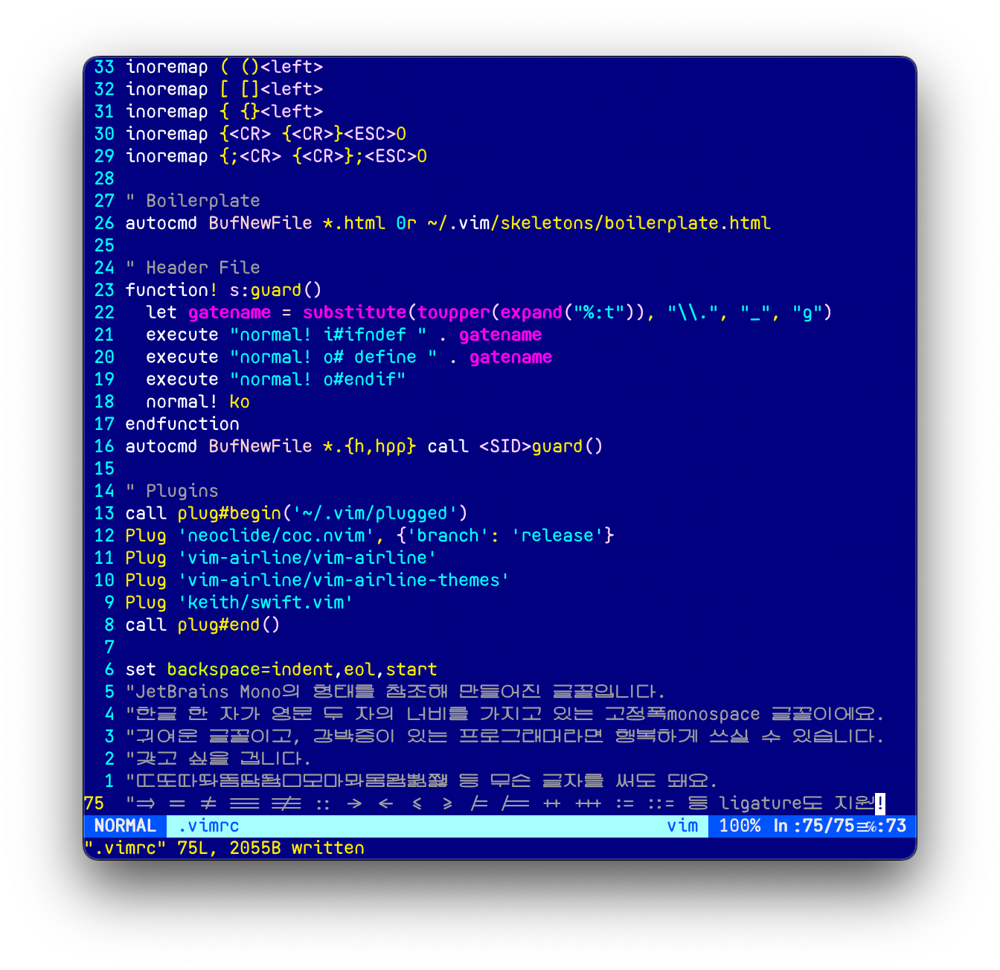

# melonbrain

## overview

- "melonbrain" is a korean monospace font made by, and for programmers.
- all(11,172) the modern korean letters are supported.  
- melonbrain's alphanumeric glyphs are influenced by [JetBrains Mono](https://www.jetbrains.com/lp/mono/) as the name suggests, but no single glyphs are the same, for this is a new font.
- some ligatures may be added in the future.
- an offspring variable font from this, better than this in many ways(or maybe lost its charm depending on your perspective), **셈틀체semteulche** is being crowdfunded [here](https://link.tumblbug.com/VAw8x20FMrb).
  
  
## license

if you happen to be a supporter of **국민의힘国民の力**, including **윤석열YoonSuckY'all** voters, first of all, fuck you, and the price you have to pay for this license is at least $28. *seriously though, fuck you.*  

  

any other decent human beings can pay $14, but since *this is a bargain price to distribute this font as widely as possible*, it would be greatly appreciated if you be generous and pay me more.

use of this font to promote 국민의힘国民の力(and any succesive or related conservative party) or 윤석열YoonSuckY'all in any way is **strictly prohibited**. except for that and redistribution/reselling of this font file(modified ones too), no limitations whatsoever.
  

## purchase

you can purchase this font from [here](https://eastriverlee.itch.io/melonbrain), or contact me directly.
